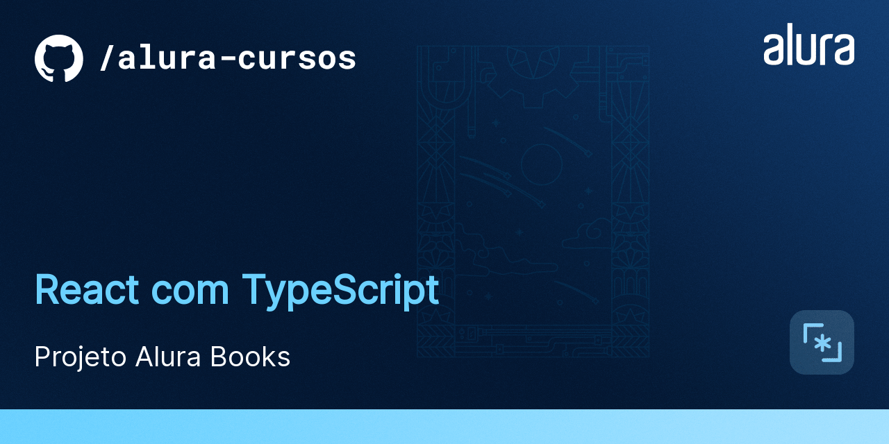

# AluraBooks

O AluraBooks é uma loja virtual que vende livros da Casa do Código. 
É um MVP que tá só começando e ainda tem muitas funcionalidades novas para serem desenvolvidas.

## 🔨 Funcionalidades do projeto

O AluraBooks começa com a página inicial já pronta, que você pode baixar e utilizar ou então... criar a sua versão baseada <a href="https://www.figma.com/file/POpX503Kobu83iGdiaICvk/React%3A-Alura-Books?node-id=119%3A3145" target="_blank">no figma</a>.
No decorrer da formação nós vamos implementar toda a camada de comunicação com a API, inclusive a autenticação.

## ✔️ Técnicas e tecnologias utilizadas

Se liga nessa lista de tudo que usaremos nessa formação:

- `React`
- `React Hooks`
- `TypeScript`
- `axios`
- `Session Storage`
- `TSDX`
- `NPM` (no primeiro curso nós criamos uma biblioteca e a publicamos no NPM)
- `Github Actions`

E muito mais!

## 🛠️ Abrir e rodar o projeto

Para abrir e rodar o projeto, execute `npm i` para instalar as dependências e `npm start` para inicar o projeto.

Depois, acesse <a href="http://localhost:3000/">http://localhost:3000/</a> no seu navegador.

## 📚 Mais informações do curso

O AluraBooks é o projeto utilizado durante toda a formação, e você pode navegar entre as branchs para encontrar o momento específico que está buscando.