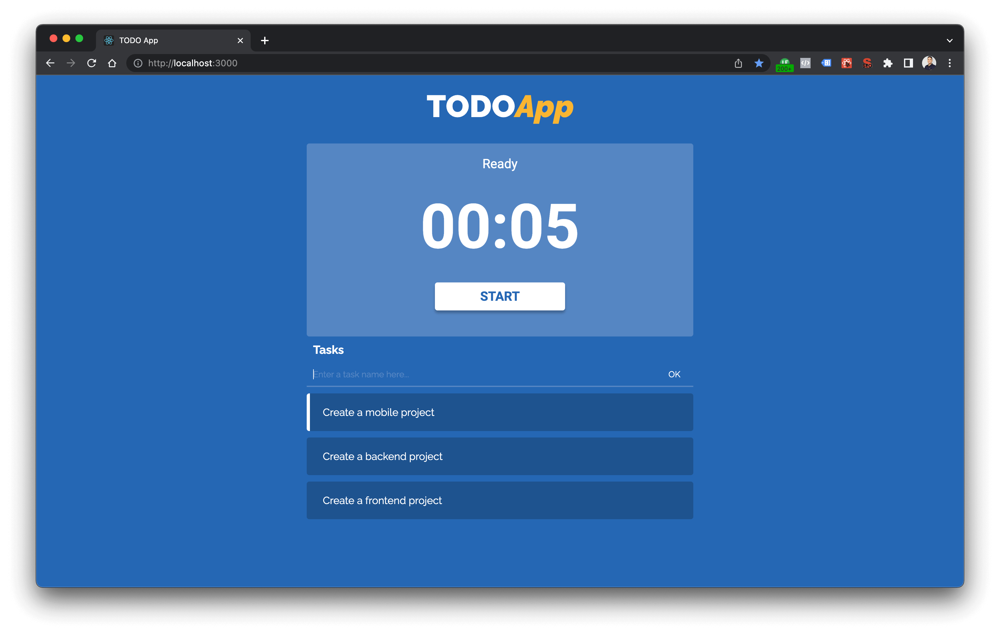

# TODO App - Frontend
This is a simple TODO App that I created and posted a video on my YouTube channel.

## Preview


## Before Installation

You should run the backend project, you can [take a look here](https://github.com/leobritob/youtube-todoapp-backend).

## Installation
```bash
$ yarn
# or npm install
```

## Running
```bash
$ yarn start
# or npm run start
```

## Tests
```bash
$ yarn test
# or npm run test
```
